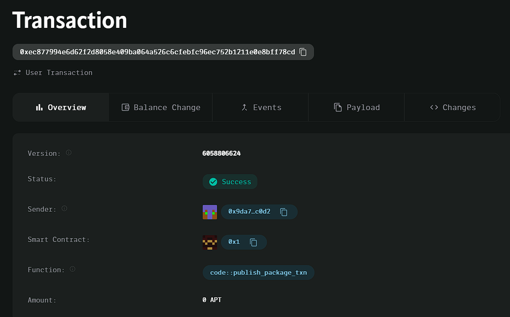

### Deployed smartcontract address: 0xec877994e6d62f2d8058e409ba064a526c6cfebfc96ec752b1211e0e8bff78cd

### Screenshot:

# Decentralized Ride-sharing Service

## Project Title
Decentralized Ride-sharing Service

## Project Description
The Decentralized Ride-sharing Service is a peer-to-peer platform that connects drivers and riders directly. Payments are handled securely and transparently using smart contracts on the blockchain, without the need for intermediaries. The platform facilitates efficient and decentralized ride booking.

## Vision
Our vision is to create a decentralized, trustless ride-sharing system that eliminates the need for traditional ride-sharing platforms. By leveraging blockchain technology, we aim to provide fair, direct, and transparent transactions between drivers and riders.

## Key Features
- **Direct Driver-Rider Connection**: Drivers can list their availability, and riders can book rides without intermediaries.
- **Smart Contract-Based Payments**: Payments are securely transferred from rider to driver using smart contracts.
- **Transparent Fare Structure**: Ride fares are listed transparently, and riders can be confident in the fairness of the transaction.
- **Decentralized Ledger**: All transactions are recorded on the blockchain, ensuring transparency and security.

## Future Scope
- **Rating System**: Implement a rating system to provide feedback for both drivers and riders.
- **Advanced Matching Algorithm**: Develop algorithms to automatically match riders and drivers based on proximity and preferences.
- **Multi-Token Support**: Allow payments in multiple tokens or cryptocurrencies, providing flexibility to users.
- **Incentive Programs**: Create rewards or loyalty programs for frequent riders and drivers.

